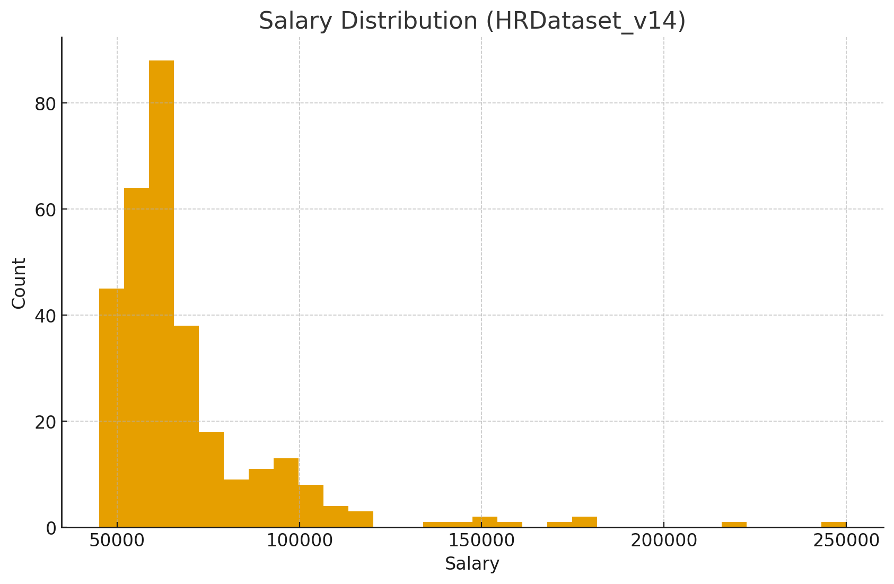
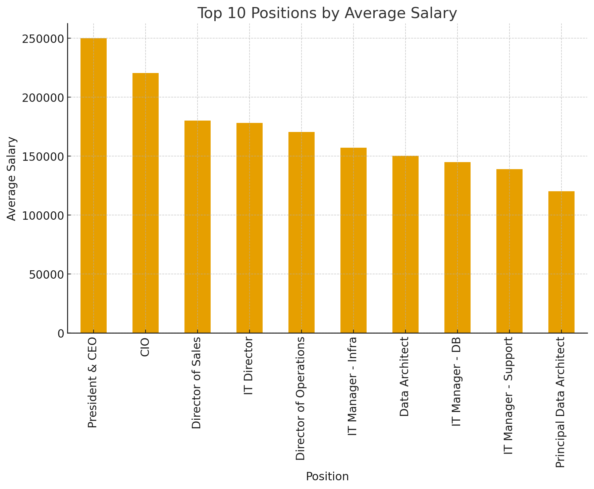
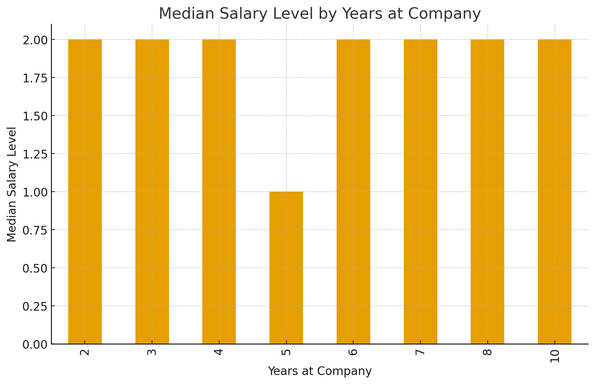

# HR Salary Dashboard – TCS iON RIO-125 Internship Project
### **Train the Dataset and Predict Salary**

This repository contains the internship project completed by **Shivam** under **TCS iON Remote Internship Program**.  
The aim of the project is to analyze HR salary datasets, perform data sanitization, visualize salary insights, and apply a Linear Regression model to predict employee salary.

---

## Internship Details
| Field | Information |
|--------|-------------|
| **Intern** | Shivam |
| **Organization** | TCS iON |
| **Project Title** | HR Salary Dashboard – Train the Dataset and Predict Salary |
| **Duration** | 22 July 2025 – 24 August 2025 *(Extended to 20 Nov 2025)* |
| **Mode** | Remote Internship |

---

##  Project Overview
This project focuses on analyzing HR employee salary data using real dataset samples.  
The goal is to clean and structure the dataset, visualize salary variations, and build a predictive model to understand salary behavior.

---Tools & Technologies---

Category	/ Used

Language /	Python
Libraries	 / Pandas, NumPy, Matplotlib, Scikit-Learn
Environment /	Jupyter Notebook / VS Code
Model Type	/ Linear Regression

#DATASET DETAILS#
Dataset Given by Tcs mentor rushikesh to all students in discussion room 

(This kind of model helps HR to better estimate salaries of new employees. Regarding dataset there is no restriction on what dataset you can use. There are different data sources available over online to get better datasets. Many participants are creating faker library to generate fake data which may not help us in creating better data, Below are some dataset suggestions but you can )


1) https://www.kaggle.com/rhuebner/human-resources-data-sel

2) https://www.kaggle.com/jacksonchou/hr-data-for-analytics

## Tasks Completed
- Cleaned HR dataset (removed duplicates, processed missing values)
- Dataset sanitization & formatting
- Salary trend visualizations for dashboard usage

- Built a Linear Regression prediction model
- Generated charts and stored results
- Prepared final project report


  
### Data Sanitization & Cleaning Performed

- Removed duplicates and formatted salary values
- Handled missing values and incorrect entries
- Converted numeric fields into comparable formats
- Verified structure consistency for modeling

_Model Output Example_

Age/Experience/Current Salary/Predicted Salary
29/	4 Years	/₹4.5 /LPA	/₹5.8 LPA


##  Visualizations

Chart type files:-

### Salary Distribution (HR Dataset)


### Average Salary (Top 10 Positions)


### Median Salary Level (Years at Company)


### Average Monthly Hours Distribution


---Installation & Setup---

pip install -r 
requirements.txt

To run model:

python
hr_salary_prediction.py


##  Project Structure
```bash
HR_Salary_Dashboard_Shivam
│
├── data/                 # Cleaned dataset files
├── src/                  # Python code (salary_dashboard.py)
├── visualizations/       # PNG charts output
└── README.md             # Project documentation
```
### Conclusion-

This project successfully analyzed HR salary trends and built a salary prediction model using Linear Regression. The dashboard visuals provide valuable insights for HR decision-making, and the trained model can help estimate salary based on employee attributes.
